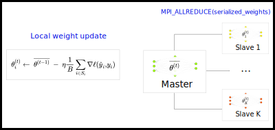

<div align="center">
<h1 align="center">
    Speeding up DNN training in distributed environments
</h1>

[](https://en.wikipedia.org/wiki/C%2B%2B17)
[](http://eigen.tuxfamily.org/)
[](https://www.open-mpi.org/)

\[[Report](./report.pdf)\]

<p align="center">
     
</p> 
</div>


## Summary

* [Introduction](#introduction)
* [Running](#running)
* [References](#references)

## Introduction

This repository contains a minimal framework to quickly prototype deep architectures and facilitate weight and gradients sharing among processing nodes.

We introduce and implement parallel DNN optimization algorithms and conduct a (hopefully complete) benchmark of the different methods, evaluated on the MNIST and Fashion-MNIST datasets.
For a full description of the project, you can check out the [project report](./report.pdf)!

## Running

This project uses the following dependencies:
- Eigen3, for basic matrix operations (also included in the repository)
- OpenMPI 2.1.1

The list of experiments available is as follows:
- `param_avg`: Weight averaging algorithm described in the report.
- `parallel_sgd`: Gradient averaging algorithm described in the report.
- `w_param_avg`: Weighted parameter averaging algorithm described in the report.

To compile and run the experiments, from the root directory:

```bash
make experiment_name
```

And then, for an MPI experiment:

```bash
mpiexec -n n_cores runmpi -options
```

Parameters are as follows. For all experiments, the following arguments are available:
- `-batch_size`: Size of each batch
- `-eval_acc`  : To be set to `1` if validation accuracies must be evaluated, `0` otherwise (in which case epoch durations are logged instead).
- `-n_epochs`  : Total number of epochs

Specifically to the following methods, additional parameters are available

**param_avg, w_param_avg**
- `-avg_freq`: Weight averaging frequency (in epochs).

**w_param_avg**
- `-lambda`: Value of the lambda parameter (integer, divided by 100).


## References
1. [Ben-Nun et al., 2018] Demystifying parallel and distributed deep learning: An in-depth concurrency analysis
2. [Ericson et al., 2017] On the performance of network parallel training in artificial neural networks
3. [Han Xiao et al., 2017] Fashion-MNIST: a novel image dataset for benchmarking machine learning algorithms.
